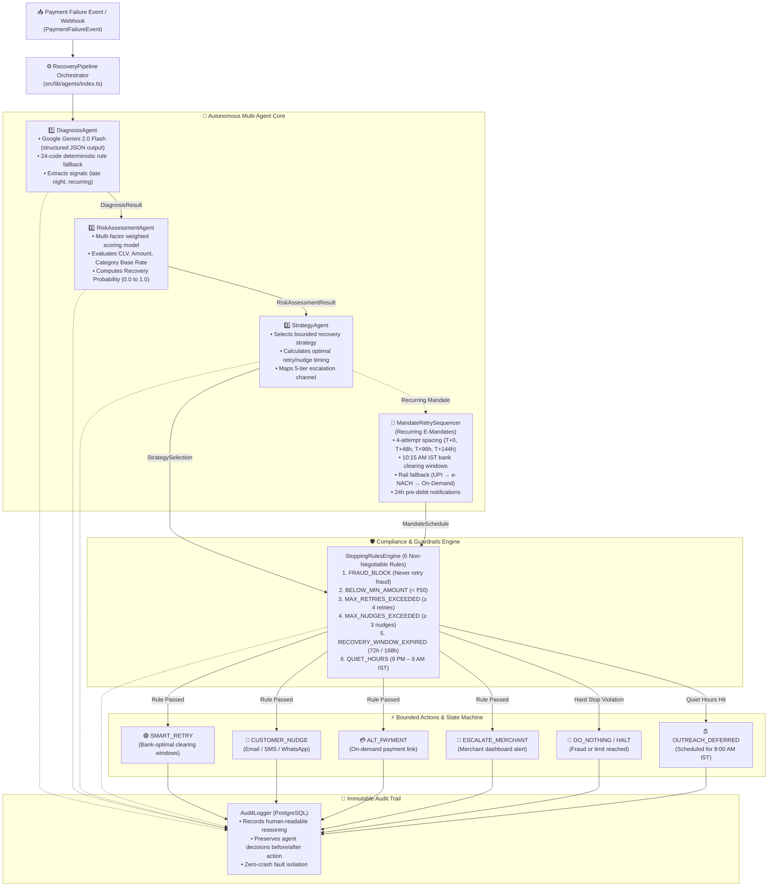

# ⚡ ReviveAI — Autonomous Payment Revenue Recovery System

> **Built for Razorpay AI Builder Buildathon 2026 — Track 03: AI Revenue Recovery**  
> An autonomous multi-agent platform that detects revenue at risk, diagnoses root causes across Indian banking rails & PSPs, and executes bounded recovery workflows with compliant stopping rules and immutable audit trails.

---

## 🎯 The Problem

In India, **30%–35% of all payment attempts degrade or fail** due to bank timeouts, insufficient funds, network drops, and PSP throttling. For a high-velocity merchant, this means lakhs of rupees in GMV leaking daily.

Current systems either **do nothing** or **blindly retry**, causing spam, customer frustration, and regulatory compliance violations.

---

## 🏗️ System Architecture


---

## 🤖 How Our Multi-Agent System Is Structured

ReviveAI implements a **custom, lightweight, type-safe multi-agent architecture in pure TypeScript** (no heavy external graph frameworks like LangGraph). This guarantees sub-millisecond execution (~12ms per transaction), 100% deterministic fallback during LLM outages or rate limits (HTTP 429), and strict compliance boundaries.



### Agent Roles & Execution Responsibilities

1. **[`DiagnosisAgent`](file:///Users/vishalkumar/revive-ai/src/lib/agents/diagnosis-agent.ts) (Root Cause Identification)**
   - Analyzes raw error codes, bank latency profiles, payment methods, and timestamps.
   - Uses **Google Gemini 2.0 Flash** for unstructured error context with an instant 24-code **deterministic rule fallback** if the API is unconfigured or rate-limited.
   - Extracts contextual signals (e.g. `late_night_failure` during 11 PM–2 AM IST, `recurring_payment` mandate context).

2. **[`RiskAssessmentAgent`](file:///Users/vishalkumar/revive-ai/src/lib/agents/risk-assessment-agent.ts) (Recovery Viability Scoring)**
   - Computes an empirical weighted recovery probability score based on 5 factors:
     - Failure Category Base Rate (weight: 0.35)
     - Customer Lifetime Value / CLV (weight: 0.25)
     - Payment Amount (weight: 0.20)
     - Diagnosis Confidence (weight: 0.10)
     - Recoverability Signal (weight: 0.10)

3. **[`StrategyAgent`](file:///Users/vishalkumar/revive-ai/src/lib/agents/strategy-agent.ts) (Intervention & Timing Sequencer)**
   - Selects the optimal recovery action: `SMART_RETRY`, `CUSTOMER_NUDGE`, `ALT_PAYMENT`, `ESCALATE_MERCHANT`, or `DO_NOTHING`.
   - Schedules retries during **bank-optimal clearing windows** (e.g., avoiding bank maintenance hours).
   - Maps customer outreach to the **5-Tier Escalation Ladder** (On-screen $\to$ Email $\to$ SMS $\to$ Merchant Alert $\to$ Dead).

4. **[`MandateRetrySequencer`](file:///Users/vishalkumar/revive-ai/src/lib/agents/mandate-sequencer.ts) (Recurring E-Mandate Recovery)**
   - Autonomous sequencer for subscription and mandate failures.
   - Implements 4-attempt spacing ($T_0 \to T+48\text{h} \to T+96\text{h} \to T+144\text{h}$) aligned with Indian bank clearing windows (10:15 AM IST).
   - Progressive rail switching: `UPI_AUTOPAY` $\to$ `E_NACH` $\to$ `ON_DEMAND_LINK`.
   - Generates mandatory 24-hour pre-debit notifications prior to each execution.

5. **[`StoppingRulesEngine`](file:///Users/vishalkumar/revive-ai/src/lib/engine/stopping-rules.ts) (Compliance Guardrails)**
   - Enforces **6 non-negotiable rules**: Fraud blocks (zero-retry), minimum amount (<₹50), max 4 retries, max 3 nudges, recovery window expiry (72h standard / 168h mandate), and **Quiet Hours** (9:00 PM – 9:00 AM IST).
   - Quiet hours safely defers customer nudges to 9:00 AM IST while permitting silent backend bank retries.

6. **[`AuditLogger`](file:///Users/vishalkumar/revive-ai/src/lib/audit/logger.ts) (Immutable Decision Trail)**
   - Writes immutable audit records to PostgreSQL before and after every recovery decision.
   - Captures human-readable reasoning, agent provenance, and metadata without blocking money movement.

---

## 📊 Evaluation & The Bar

ReviveAI is built specifically to address the criteria defined in **Track 03 — The Bar**:

| Criterion | Implementation in ReviveAI |
|---|---|
| **Measured money recovered across a batch** | Built-in batch simulation runner testing 1,000+ payments against empirical Indian payment failure distributions, outputting exact recovered GMV and recovery percentages. |
| **Compliant escalation** | 5-level escalation ladder (On-screen → Email nudge → SMS reminder → Merchant alert → Dead stop). |
| **Stopping rules** | Strict rule engine verifying fraud blocks, retry limits, quiet hours, and minimum recovery amounts before any action. |
| **Audit trail** | Immutable `audit_logs` table storing every agent's chain-of-thought, decision factors, and timestamps. |

---

## 🚀 Quick Start

### Prerequisites
- Node.js >= 18.x
- PostgreSQL database (Neon, Supabase, or local)
- Google AI Studio API Key ([Get free key](https://aistudio.google.com/))

### Installation

```bash
# 1. Clone repository
git clone https://github.com/vishalkumar-ai25/revive-ai.git
cd revive-ai

# 2. Install dependencies
npm install

# 3. Setup environment variables
cp .env.example .env
# Fill in your DATABASE_URL and GOOGLE_AI_API_KEY

# 4. Generate Prisma Client & push schema
npm run db:push
npm run db:seed

# 5. Run development server
npm run dev
```

Visit `http://localhost:3000` to access the Merchant Recovery Dashboard.

### Running Batch Simulations via CLI

```bash
# Run 100 payment simulation
npx tsx src/lib/simulation/batch-runner.ts 100

# Run 1,000 payment benchmark
npx tsx src/lib/simulation/batch-runner.ts 1000
```

---

## 🛠 Tech Stack

- **Framework**: Next.js 14 (App Router, Server Actions, Route Handlers)
- **Language**: TypeScript (Strict mode enabled)
- **AI & LLM**: Google Gemini 2.0 Flash (`@google/generative-ai`)
- **Database & ORM**: PostgreSQL + Prisma ORM
- **UI & Styling**: Tailwind CSS, Lucide Icons, Radix UI

---

## 👨‍💻 Author

**Vishal Kumar**  
B.Tech, Mathematics & Computing, IIT (ISM) Dhanbad  
GitHub: [@vishalkumar-ai25](https://github.com/vishalkumar-ai25)
