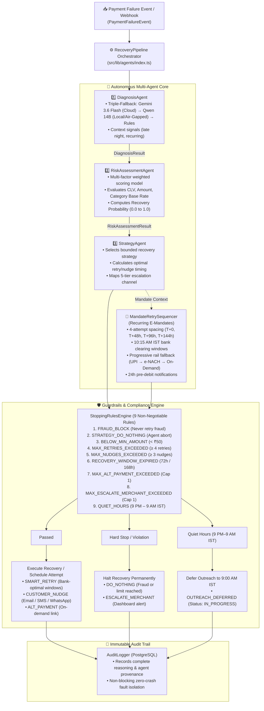

# ⚡ ReviveAI — Autonomous Payment Revenue Recovery System

> **Razorpay AI Builder Buildathon 2026 — Track 03: AI Revenue Recovery**  
> An autonomous multi-agent platform that detects revenue at risk, diagnoses root causes across Indian banking rails & PSPs, and executes bounded recovery workflows with compliant stopping rules and immutable audit trails.

---

<div align="center">

[](https://github.com/vishalkumar-ai25/revive-ai)
[-brightgreen.svg?style=flat-square)](https://github.com/vishalkumar-ai25/revive-ai)
[](https://github.com/vishalkumar-ai25/revive-ai)
[-blue.svg?style=flat-square)](https://github.com/vishalkumar-ai25/revive-ai)
[](https://github.com/vishalkumar-ai25/revive-ai)

</div>

---

## 🎯 The Problem

In India, **30%–35% of all payment attempts degrade or fail** due to bank timeouts, insufficient funds, network drops, and PSP throttling. For a high-velocity merchant, this means lakhs of rupees in GMV leaking daily.

Current systems either **do nothing** or **blindly retry**, causing spam and customer frustration. ReviveAI enforces a strict operational escalation ladder — quiet-hours suppression, zero-retry fraud blocks, and mandate pre-debit notice — informed by e-mandate industry practice.

---

## 🏗️ How Our Multi-Agent System Is Structured

ReviveAI implements a **custom, lightweight, type-safe multi-agent architecture in pure TypeScript** (zero heavy framework overhead like LangGraph). This guarantees fast execution, 100% deterministic fallback during LLM outages or rate limits (HTTP 429), and strict compliance boundaries.



---

### 🤖 Agent Roles & Responsibilities

1. **[`DiagnosisAgent`](file:///Users/vishalkumar/revive-ai/src/lib/agents/diagnosis-agent.ts) (Root Cause Identification)**
   - Analyzes raw error codes, bank latency profiles, payment methods, and timestamps.
   - Features a **Triple-Fallback Architecture**: Uses Google Gemini 3.6 Flash (Cloud) as primary, instantly falls back to an air-gapped **Qwen 2.5 14B** via Ollama for privacy-sensitive batch runs, and ultimately defaults to a 24-code deterministic rules engine if no AI is available.
   - Extracts contextual signals (e.g. `late_night_failure` during 11 PM–2 AM IST, `recurring_payment` mandate context).

2. **[`RiskAssessmentAgent`](file:///Users/vishalkumar/revive-ai/src/lib/agents/risk-assessment-agent.ts) (Recovery Viability Scoring)**
   - Computes an empirical weighted recovery probability score based on 5 factors:
     - Failure Category Base Rate (weight: 0.35)
     - Customer Lifetime Value / CLV (weight: 0.25)
     - Payment Amount (weight: 0.20)
     - Diagnosis Confidence (weight: 0.10)
     - Recoverability Signal (weight: 0.10)

3. **[`StrategyAgent`](file:///Users/vishalkumar/revive-ai/src/lib/agents/strategy-agent.ts) (Intervention & Timing Sequencer)**
   - Selects the optimal recovery action: `SMART_RETRY`, `CUSTOMER_NUDGE`, `ALT_PAYMENT`, `ESCALATE_MERCHANT`, or `DO_NOTHING`.
   - Schedules retries during **bank-optimal clearing windows** (e.g., avoiding bank maintenance hours).
   - Maps customer outreach to the **5-Tier Escalation Ladder** (On-screen $\to$ Email $\to$ SMS $\to$ Merchant Alert $\to$ Dead).

4. **[`MandateRetrySequencer`](file:///Users/vishalkumar/revive-ai/src/lib/agents/mandate-sequencer.ts) (Recurring E-Mandate Recovery)**
   - Autonomous sequencer for subscription and recurring mandate failures.
   - Implements 4-attempt spacing ($T_0 \to T+48\text{h} \to T+96\text{h} \to T+144\text{h}$) aligned with Indian bank clearing windows (10:15 AM IST).
   - Progressive rail switching: `UPI_AUTOPAY` $\to$ `E_NACH` $\to$ `ON_DEMAND_LINK`.
   - Triggers 24-hour pre-debit notifications (`preDebitNotificationSentAt`) prior to each execution, enforcing an operational policy informed by e-mandate industry practice.

5. **[`StoppingRulesEngine`](file:///Users/vishalkumar/revive-ai/src/lib/engine/stopping-rules.ts) (Compliance Guardrails)**
   - Enforces **9 non-negotiable rules**: FRAUD_BLOCK (Never retry fraud), STRATEGY_DO_NOTHING (Agent abort), BELOW_MIN_AMOUNT (< ₹50), MAX_RETRIES_EXCEEDED (≥ 4 retries), MAX_NUDGES_EXCEEDED (≥ 3 nudges), RECOVERY_WINDOW_EXPIRED (72h / 168h), MAX_ALT_PAYMENT_EXCEEDED (Cap 1), MAX_ESCALATE_MERCHANT_EXCEEDED (Cap 1), and QUIET_HOURS (9 PM – 9 AM IST).
   - Quiet hours safely defers customer nudges to 9:00 AM IST while permitting silent backend bank retries.

6. **[`AuditLogger`](file:///Users/vishalkumar/revive-ai/src/lib/audit/logger.ts) (Immutable Decision Trail)**
   - Writes immutable audit records to PostgreSQL before and after every recovery decision.
   - Captures human-readable reasoning, agent provenance, and metadata without blocking financial state changes.

---

## 📜 Explainable AI in Action — Real Multi-Agent Audit Trail

Every recovery decision in ReviveAI writes an immutable provenance log capturing the full chain-of-thought across all agents. Below is an actual audit trail for a transaction that failed late at night:

```json
[
  {
    "agentName": "DiagnosisAgent",
    "action": "DIAGNOSIS_COMPLETE",
    "reasoning": "Category: CARD_DECLINED | Root cause: The card used for the transaction is restricted and does not permit transactions, likely due to security or fraud prevention measures. | Confidence: 100% | Recoverable: false",
    "metadata": {
      "category": "CARD_DECLINED",
      "confidence": 1,
      "signals": [
        { "name": "Error Code", "value": "CARD_DECLINED", "weight": 1 },
        { "name": "Error Description", "value": "Restricted card - transaction not permitted", "weight": 1 }
      ]
    }
  },
  {
    "agentName": "RiskAssessmentAgent",
    "action": "RISK_ASSESSED",
    "reasoning": "Recovery not attempted due to stopping rule evaluation.",
    "metadata": {
      "recoveryProbability": 0.61,
      "shouldAttemptRecovery": false,
      "factors": [
        { "name": "failure_category", "score": 0.25, "detail": "CARD_DECLINED has a base recovery rate of 25%", "weight": 0.35 },
        { "name": "diagnosis_confidence", "score": 1, "detail": "Diagnosis confidence: 100% - high certainty", "weight": 0.1 }
      ]
    }
  },
  {
    "agentName": "StrategyAgent",
    "action": "STRATEGY_SELECTED",
    "reasoning": "Recovery skipped: Recovery not attempted due to stopping rule evaluation.",
    "metadata": {
      "strategy": "DO_NOTHING",
      "confidence": 0.95,
      "executionParams": { "escalationLevel": "LEVEL_5_DEAD" }
    }
  },
  {
    "agentName": "StoppingRulesEngine",
    "action": "RECOVERY_STOPPED",
    "reasoning": "Agent elected to DO_NOTHING. Recovery aborted.",
    "metadata": { "rule": "STRATEGY_DO_NOTHING", "intendedStrategy": "DO_NOTHING" }
  }
]
```

---

## 📊 Evaluation & The Bar

ReviveAI is built specifically to address the criteria defined in **Track 03 — The Bar**:

| Judging Criterion | Implementation in ReviveAI | Direct Verification Command |
|---|---|:---:|
| **1. Measured money recovered across a batch** | Simulates 1,000+ payments across realistic Indian failure distributions, tracking recovered GMV and percentage lift. | `npm run simulate 1000` |
| **2. Compliant escalation ladder** | 5-level progressive contact ladder (`On-screen` $\to$ `Email` $\to$ `SMS` $\to$ `Merchant Alert` $\to$ `Dead stop`). | `npx tsx --test tests/multi-attempt-lifecycle.test.ts` |
| **3. Strict stopping rules** | Pure rule engine enforcing 4-retry cap, 3-nudge cap, quiet hours (9 PM–9 AM IST), and zero-tolerance fraud blocks. | `npx tsx --test tests/stopping-rules.test.ts` |
| **4. Immutable audit trail** | Immutable `audit_logs` table storing every agent's step-by-step chain-of-thought, decision factors, and timestamps. | `npx tsx --test tests/pipeline.test.ts` |
| **5. Concurrency Guard** | Atomic CTE with row-level locking (`SELECT FOR UPDATE SKIP LOCKED`) prevents double-processing during concurrent background jobs. | `npx tsx --test tests/concurrency-guard.integration.test.ts` |


---

## 📈 1,000-Payment Batch Simulation Benchmark

To prove the system's scalability and decision-making logic, we built a virtual time-travel simulator. It ingests synthetic failed payments and advances a virtual clock over a 169-hour period, running the multi-agent pipeline against every payment and its subsequent retries.

**Risk Model Calibration (Primary Evidence of Model Quality)**
The raw "% recovered" number is a *simulation output*, not a validation result, because the simulation relies on assumptions to determine success. To validate the actual quality of the `RiskAssessmentAgent`, the simulator evaluates it against a hidden, independently perturbed ground-truth probability. 

The **Part 5: Risk Model Calibration** section in the benchmark report below is the primary validation result, demonstrating that the agent's predicted probabilities closely map to actual simulation recovery rates.

### Actual Benchmark Report Output (Local Postgres + Qwen 14B, 1,000 Payments, seed=42)

```text
━━━━━━━━━━━━━━━━━━━━━━━━━━━━━━━━━━━━━━━━━━━━━━━━━━━━━━━━━━━━━━━━━━━━━━━━━━━━━━━━
  📊 REVIVE AI — BATCH RECOVERY BENCHMARK REPORT (1,000 PAYMENTS)
━━━━━━━━━━━━━━━━━━━━━━━━━━━━━━━━━━━━━━━━━━━━━━━━━━━━━━━━━━━━━━━━━━━━━━━━━━━━━━━━
```


*Note: Quiet-hours deferrals appear as `0` in the benchmark because the StrategyAgent proactively schedules nudges for 9:00 AM IST, pre-empting the stopping-rules engine from needing to block them during quiet hours.*

---

## ⚡ Known Limitations & Performance Notes

The benchmark above (Qwen 14B + local Postgres) completed 1,000 payments in **2478.4s (~2478ms per payment)**. A separate rules-only run on local Postgres (`docs/benchmark_1000_payments_canonical.txt`) completed the same workload in **1.7s (~2ms per payment)** — roughly a **1,200× throughput gap**.

### Why the gap exists

| Bottleneck | Impact |
|---|---|
| **Sequential per-payment LLM calls** | Each payment triggers a `DiagnosisAgent` call to a local Ollama/Qwen 14B instance. The 14B-parameter model generates ~20–50 tokens/sec, adding ~2–3s of GPU inference per payment. The deterministic rules fallback replaces this with a sub-millisecond hash-map lookup. |
| **Low concurrency limit** | `batch-runner.ts` processes ingestion in chunks of `CONCURRENCY_LIMIT = 3` (deliberately reduced from 20 to prevent local Postgres connection/socket exhaustion during development). This serializes most of the batch. |
| **Database round-trips** | Each payment involves multiple Prisma `create`/`update` calls. On a hosted database (e.g., Neon), each round-trip adds network latency vs. a local Unix-socket Postgres connection. |

### Concrete next steps for production throughput

1. **Batch/parallelize diagnosis calls.** Group payments with identical `errorCode` values and make a single LLM call per group, or run multiple Ollama instances behind a load balancer to process payments concurrently.
2. **Raise concurrency on pooled Postgres.** In production, use a connection pooler (e.g., PgBouncer or Neon's built-in pooler) and increase `CONCURRENCY_LIMIT` back toward 20+ without risking socket exhaustion.
3. **Cache diagnosis results.** Many payments share the same `(errorCode, errorDescription, method)` tuple. Caching the `DiagnosisAgent` output for repeated identical inputs would eliminate redundant LLM calls.
4. **Async queue-based processing.** Replace the synchronous batch loop with a job queue (e.g., BullMQ / pg-boss) so payments are processed as workers become available, decoupling ingestion from LLM throughput.

These are engineering improvements for a production deployment; the current architecture is deliberately optimized for correctness and auditability during the hackathon evaluation phase.

---

## 🧪 Automated Test Suite (`npm test`)

Run the complete test suite verifying all 5 agents, escalation ladders, mandate sequencing, and stopping rules:

```bash
npm test
```

```text
# tests 146
# suites 34
# pass 146
# fail 0
# cancelled 0
# skipped 0
# duration_ms 608.56ms
```

> [!TIP]
> If you see a `@prisma/client did not initialize` error, you can run the DB-independent subset with `npm run test:offline` — no Postgres or `npx prisma generate` required.

---

## 🚀 Quick Start

### Prerequisites
- Node.js >= 20.x
- PostgreSQL database (Neon, Supabase, or local)
- `GOOGLE_AI_API_KEY` ([Get free key](https://aistudio.google.com/)) *(Optional for cloud AI)*
- `OLLAMA_BASE_URL` *(Optional: Set to `http://localhost:11434` to run the entire pipeline securely on air-gapped local LLMs like Qwen 14B)*
*Note: If neither AI is configured, the DiagnosisAgent instantly falls back to a 24-code deterministic mapping for zero-friction testing.*

### Installation

```bash
# 1. Clone repository
git clone https://github.com/vishalkumar-ai25/revive-ai.git
cd revive-ai

# 2. Install dependencies
npm install

# 3. Setup environment variables
cp .env.example .env
# Fill in your DATABASE_URL in .env
# Add RECOVERY_LINK_HMAC_SECRET (required for email verification links)
# Add WEBHOOK_SIGNING_SECRET (required for Razorpay webhook validation)

# 4. Push database schema
npx prisma generate
npx prisma db push

# 5. Seed with initial simulated batch
npm run simulate 50

# 6. Run development server
npm run dev
```

Visit **`http://localhost:3000`** to access the Merchant Recovery Dashboard.

---

## 🛠 Tech Stack

- **Framework**: Next.js 14 (App Router, Server Actions, Route Handlers)
- **Language**: TypeScript (Strict mode enabled — 0 errors)
- **AI & LLM**: Google Gemini 3.6 Flash (Cloud), Qwen 2.5 14B / Ollama (Air-gapped on-premise)
- **Database & ORM**: PostgreSQL + Prisma ORM
- **UI & Styling**: Tailwind CSS, Lucide Icons, Radix UI

---

## 👨‍💻 Author

**Vishal Kumar**  
B.Tech, Mathematics & Computing, IIT (ISM) Dhanbad  
GitHub: [@vishalkumar-ai25](https://github.com/vishalkumar-ai25)
