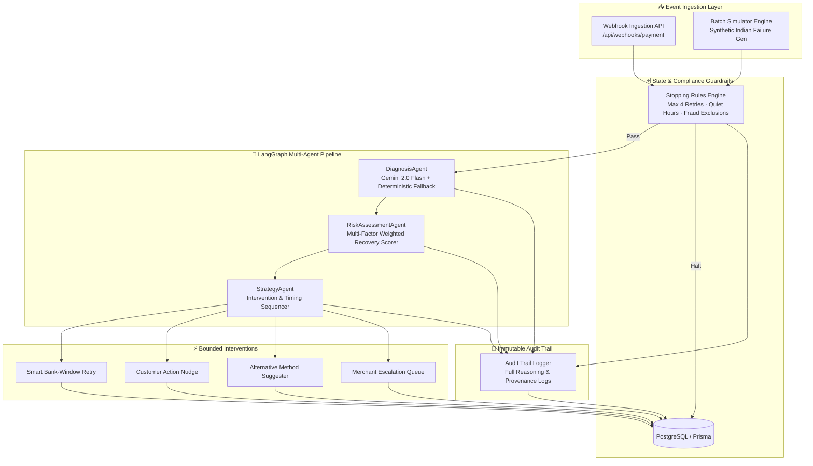

# ⚡ ReviveAI — Autonomous Payment Revenue Recovery System

> **Built for Razorpay AI Builder Buildathon 2026 — Track 03: AI Revenue Recovery**  
> An autonomous multi-agent platform that detects revenue at risk, diagnoses root causes across Indian banking rails & PSPs, and executes bounded recovery workflows with compliant stopping rules and immutable audit trails.

---

## 🎯 The Problem

In India, **30%–35% of all payment attempts degrade or fail** due to bank timeouts, insufficient funds, network drops, and PSP throttling. For a high-velocity merchant, this means lakhs of rupees in GMV leaking daily.

Current systems either **do nothing** or **blindly retry**, causing spam, customer frustration, and regulatory compliance violations.

---

## 🏗️ System Architecture



---

## 🤖 The Multi-Agent Pipeline

1. **`DiagnosisAgent` (Root Cause Identification)**
   - Analyzes raw error codes, bank latency profiles, payment methods, and timestamps.
   - Powered by **Google Gemini 2.0 Flash** for unstructured error context with zero-latency deterministic pattern fallback.

2. **`RiskAssessmentAgent` (Recovery Viability & Probability Scoring)**
   - Computes weighted recovery probability based on customer LTV, failure category, transaction value, and past interaction history.

3. **`StrategyAgent` (Intervention & Timing Sequencer)**
   - Determines the bounded intervention strategy: `SMART_RETRY`, `CUSTOMER_NUDGE`, `ALT_PAYMENT`, `ESCALATE_MERCHANT`, or `DO_NOTHING`.
   - Schedules retries based on **bank-specific operational success windows** (e.g. avoiding HDFC 11 PM–1 AM maintenance windows).

4. **`StoppingRulesEngine` (Compliance & Guardrails)**
   - Enforces **strict bounds**: Max 4 retries, max 3 nudges, 72-hour window expiry, and zero retries on bank-flagged fraud.
   - Respects **Quiet Hours** (9 PM – 9 AM IST) to prevent customer harassment.

---

## 📊 Evaluation & The Bar

ReviveAI is built specifically to address the criteria defined in **Track 03 — The Bar**:

| Criterion | Implementation in ReviveAI |
|---|---|
| **Measured money recovered across a batch** | Built-in batch simulation runner testing 1,000+ payments against empirical Indian payment failure distributions, outputting exact recovered GMV and recovery percentages. |
| **Compliant escalation** | 5-level escalation ladder (On-screen → Email nudge → SMS reminder → Merchant alert → Dead stop). |
| **Stopping rules** | Strict rule engine verifying fraud blocks, retry limits, quiet hours, and minimum recovery amounts before any action. |
| **Audit trail** | Immutable `audit_logs` table storing every agent's chain-of-thought, decision factors, and timestamps. |

---

## 🚀 Quick Start

### Prerequisites
- Node.js >= 18.x
- PostgreSQL database (Neon, Supabase, or local)
- Google AI Studio API Key ([Get free key](https://aistudio.google.com/))

### Installation

```bash
# 1. Clone repository
git clone https://github.com/vishalkumar-ai25/revive-ai.git
cd revive-ai

# 2. Install dependencies
npm install

# 3. Setup environment variables
cp .env.example .env
# Fill in your DATABASE_URL and GOOGLE_AI_API_KEY

# 4. Generate Prisma Client & push schema
npm run db:push
npm run db:seed

# 5. Run development server
npm run dev
```

Visit `http://localhost:3000` to access the Merchant Recovery Dashboard.

### Running Batch Simulations via CLI

```bash
# Run 100 payment simulation
npx tsx src/lib/simulation/batch-runner.ts 100

# Run 1,000 payment benchmark
npx tsx src/lib/simulation/batch-runner.ts 1000
```

---

## 🛠 Tech Stack

- **Framework**: Next.js 14 (App Router, Server Actions, Route Handlers)
- **Language**: TypeScript (Strict mode enabled)
- **AI & LLM**: Google Gemini 2.0 Flash (`@google/generative-ai`)
- **Database & ORM**: PostgreSQL + Prisma ORM
- **UI & Styling**: Tailwind CSS, Lucide Icons, Radix UI

---

## 👨‍💻 Author

**Vishal Kumar**  
B.Tech, Mathematics & Computing, IIT (ISM) Dhanbad  
GitHub: [@vishalkumar-ai25](https://github.com/vishalkumar-ai25)
